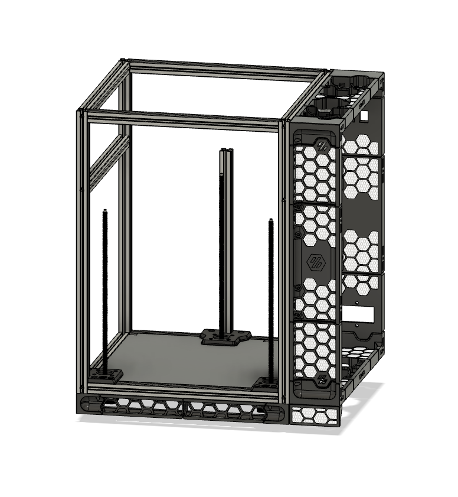
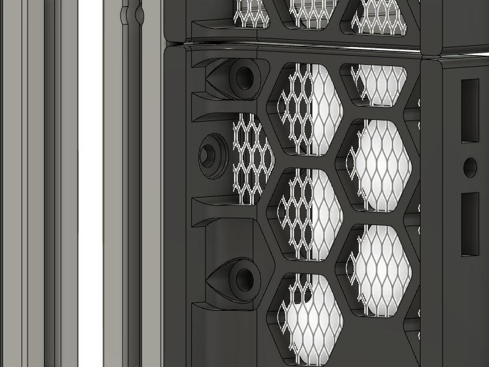
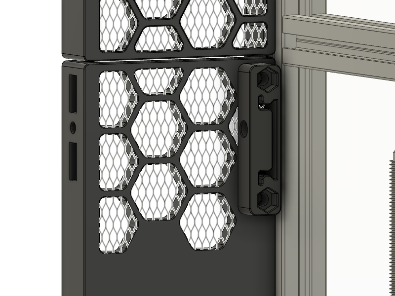

# Printed_SideSkirt
A fully printed mod intended for a Voron Trident to relocate the electronics to the side of the printer with as little deviation from the standard BOM as possible.

Heavily inspired by by `kyledavis417#2007`'s [Trident sidepack mod](https://github.com/3DPrintingMods/VoronTrident-Sidepack).

Huge thanks to the Voron design team for everything!

#

Current design assumes a total thickness of side panel + foam tape = 3mm

This mod could also be mounted on the rear of a printer, but this prevents access to the A/B belts at the rear of the gantry as well as moving the power inlet to the side of the machine, which may or may not be preferable

Uses a completely stock Voron Spec Trident frame. Verticals are all the same length for 250 / 300 / 350, so the front and rear pieces will be the same for all sizes. 
LDO frames are taller, and will require modification --TODO!.

Total width of the side skirts is 88mm. 

Total height of the lower skirts is 36mm.
For smaller builds, It may be beneficial to use the standard full size Lower Skirts for more space for electronics.

  

# Future Plans
- [ ] finish lower skirts and update for standard frames
- [ ] add other power inlet types
- [ ] add support for 300 & 350 frames
- [ ] add support for LDO frames
- [ ] add some sort of display capability in the side skirt, mabye a btt TFT43 if it is at all possible to rotate the display by 90 degrees.

# EVERYTHNG BELOW THIS IS A WORK IN PROGRESS

# BOM Changes

+ 1x side panel of your size 250/300/350 - modified to allow for cable pass-through (OR PRINT the side panel)
+ 8x M5x10 BHCS
+ 8x M5 nut
+ 16x M3x8 SHCS
+ 12x M3x4x5 Heat set inserts

# Installation

FOAM TAPE IS REQUIRED BETWEEN THE SIDE PANEL AND THE FRAME. FRONT Z MOTOR WILL BIND ON THE PANEL WITHOUT CLEARANCE.

### SideSkirt mounted on the right side of the printer
- Z_rear parts & Cable chain mount are mirrored in X 
- Deck panel mounted upside down

### Lower Skirt corners
- For the front corners, install the captive M5 nut for the rubber feet before mounting to the frame. Inserting the nut after attaching to the frame is not possible due to clearance with the steppers.

### DIN Rail mounts
- The din rails mount via M5x16 BHCS with captive nuts through the skirt

  

  

